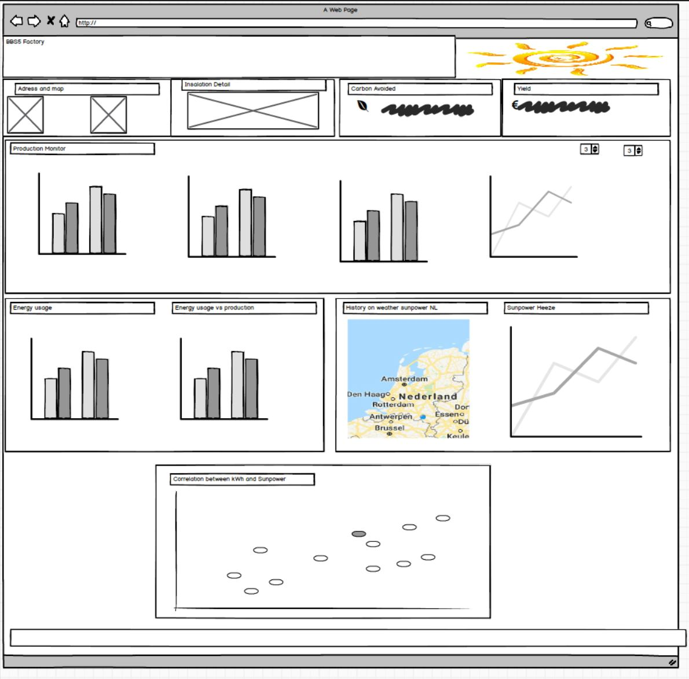

# Energy Factory BB55 Milestone 2
## Energy monitor Dashboard
By Yvett Smith

This Dashboard will be used mainly by a owner of solar panels. To have an overview of the monthly, daily energy that was produced by the solar panels.

The user will also be able to do inspection on usage and production and will have an idea what is the impact of the sun power forecasted on the production.

Click [here](https://lemoenskil.github.io/Milestone2-_BBS5_Factory_dashbord/) to see the website.

## UX
This Dashboard if for a home solar panel owner. The owner will use this dashboard to get an overview of the production on the historical data

### Strategy plane

#### Build Interactive Dashboard for a Home solar panel installation.
    
The Dashboard has the following requirements: 
• Their primary target audiences are owners or prospective owners of Solar Home Installation 
• The Dashboard need to include the following -installation address and location. 
-installation summery -Totals for carbon avoided and Euro earned 
-Graphs that show the daily and monthly and yearly production in kWh. 
-Graph that show the monthly usage compare to production 
-Heat map showing sun power weather data for on the Netherlands 
-Line Graph showing the sun power over the location of the solar installation. 
-Scatterplot showing the correlation between sun energy and power production

•  I need the following for the dashboard
-photo of the installation
-Summery of the installation
-data file of kWh produced
-Data of consumed energy
-information on tariff and carbon avoided
-Weather data (KMNI)
•  Need a selector to choose the year and one to choose between euro and kWh
•  A map will also need to show the installation location

#### User stories:
Stories:
•  As a user, I'd like to see clean, well presented data in easy to understand/read format (graphs, charts, etc…) 
•  As a user, I'd like to see a variety of charts/graphs to show different data in the dataset 
•  As a user, I’d like for the dashboard to be made so that it will work and adapt to all manner of devices (responsive design) 
•  As a user, I'd like to see some text to explain the data/statistics being seen on screen, giving further knowledge/context to the data being displayed 
•  As a user, I'd like to see engaging use of colour making the dashboard pleasant to look at and keeping the user interested 
•  As a user, I'd like to see easy to read font format for both the title/heading and all other writing on the dashboard 
•  As a user, I'd like to be able to see the difference between kWh, Euro’s 
•  As a user, I’d like to be able to have an overview of day, month and year data 
•  As a user I’d like to be to compare data from the weather with my solar production 
•  As a user, I'd like to be able to reset all the filters placed through clicks on the graphs with a simple button (therefore reverting the data shown on the graphs back to the default data)

#### Putting it all in the strategy plane

Project Purpose:
I am creating a Data dashboard aimed towards helping current and prospective home solar panel installation owner getting an overview of their production, yield, carbon avoided and cost. 
The data dashboard will use both D3, leaflet and DC to plot multiple charts that will focus on different aspects of the dataset that I am using. The information I will mainly focus on is the energy/power production per day month and year. 
I will only include the data from the date of installation from 19 September. The usage date will be from Jan 2019.
The dashboard will also include google map API. With the date from the KMNI Dutch weather a correlation map between the energy and sun power will be plotted Why would a user want this? 
In the current state of global warming solar power is a hot topic. The user will not only want to save the planet but also want to see what is in it for him, and that will be financially. 
As a user is would be nice to have a look as historical weather data do see what the correlation is between the weather and the production will be. 
The user will also want it to get an overview in of his current production vs usage this can help in decisions for example extending the capacity of using the current capacity better. 
(example if you want to move from the gas supply to only electrical) 
Why is this so special? The Data dashboard will stand out as it will have graphs that are easy to read and comprehend, and these will present the dataset in a way that provides the user with all the required information. 
User Experience There will be clean, well presented data in easy to understand/read format (graphs, charts, etc…), this will be the main draw to the dashboard. The dashboard will also have responsive design, 
so it can display correctly on mobile devices, right through to large desktops, therefore allowing the information to be accessed and viewed properly no matter where you are or what device you are using. 
There will also be summaries with some text included on the page to explain the data/statistics being seen on screen, giving further knowledge/context to the data being displayed.

    
### Scope Plane
    What they say they need
    • A Dashboard.
    • View their historical data
    • See profit made
    • Show that they are contributing to greener future

    What they actually need
    • Response Dashboard.
    • That can be viewed on a mobile.
    • Gives totals on monthly, yearly and daily 
    

### Structure Plane

Will be a simple tree structure using a horizontal bar near the top of the page taking up the right two thirds of the page. 
    Interaction Design (IXD) 
    • The Navbar will have the name of the installation and a logo 
    • For the colour scheme a Bootswatch slate will be used. 
    • One section will be used with a grid to it. 
    • There will be a footer at the end that redirect you back to the top
    
### Skeleton Plane

#### mock-ups:

In the links below you can see the mock-up’s that I drew using the mock-up tool “Balsamiq”:

- 
**Note that the final design has changed from the original design in the mock-ups. The reason why it has changed. I was trying different layouts while I was experimenting and learning the code and sometimes the new designs looked better than the original ones or was just more responsive. *

#### Design Ideas
The layout and design of the dashboard will be divided into blocks to give a professional and of a high standard look. I broke the design down into various style decisions:

##### Font
I will be using “Roboto” that comes with the Bootswatch template.

##### Colour Scheme
I am using the “Sandstone” theme from Bootswatch.

## Features

### Existing Features
#### Feature 1 - Navbar
the navbar has the logo and name with a floating reset button

#### Feature 2 - Location map
The google API to show the solar panels on the map with a solar panel icon.

#### Feature 3 - Summery of Euro and carbon on monitory graphs
The total euro and total carbon as with the selected graph.

#### Feature 4 - Jumbotron
Jumbotron that give a outline of the Dashboard

#### Feature 5 - Solar panel production navbar with dropdowns
The navbar for the solar production graphs has 2 dropdowns 
-One where the user can choose a year.
-A drop down to check the euro value or kwh value for the 4 graphs.
#### Feature 6 - Solar panel monitor graphs
-3 Bar charts for yearly, monthly and daily data. Each of them with a reset that is hidden with nothing is selected. 
-Line chart to show the hourly production with reset the is hidden when nothing is selected. The graph also has a brush on to for selection a certain range.

#### Feature 7 - Usage vs production graphs
-Bar chart with a selector to choose year. the chart also has a reset function 
-Composite chart with a bar and a line chart to show the production vs the usage. The chart is also fitted with a brush selector and reset function.

#### Feature 8 - Scatter plot
The scatter plot i have combine date and plotted it kWH, Radiation and Day.

#### Feature 9 - Heat Map
-Used leafet API to create a map with Radiation date per weather station in the Netherland. 
-The map has a time dimension control player that is the standard one for leaflet. 
--need to check how to reset the map as when you use the player the interactive charts do not work

#### Feature 10 - Sun power charts
-2 Bar charts that are interactive on the heatmap on selected dates 
-Weather station selector where the weather station of choice can be selected. 
-As I have the problem that I do not know how to reset the heatmap yet i have put a reset button for the map to use with the interactive charts.

#### Feature 11 - Footer
The footer has some reference and a reset button with a hover function

#### Feature 12 - Data update script
A python scrip to combine the daily production files into one file

### Features Left to Implement
#### Feature 1 - Customizing the play functionality on the heatmap  
-To add a function to reset play and work with interactive maps
#### Feature 2 – Try to get live date in for solar panel productionn
-At the moment that I download my data, I would like my current solar production.
#### Feature 3 – Forecasted sun radiation
-Will be nice to have the 14 days forecasted radiation to determine expected yield

## Technologies Used

    •	AWS cloud9
    •	Balsamiq
    •	HTML5
    •	CSS3
    •	Bootstrap
    •	notepad++
    •	leafet
    •	Font awesome
    •	GIT
    •	GITHUB
    •	Google Chrome developer tools
    •	Cloud 9 IDE
    •	Javascript
    •	JQuery
    •	Python
    •	DC, D3 and cross filter
    •	Google map API
    
## Testing

### Validation

- Used https://validator.w3.org/ in order to validate the HTML code.
- Used https://jigsaw.w3.org/css-validator/ in order to validate the CSS code.

### Features and responsiveness testing
•	The navbar was test on responsiveness and the reset button was changed to a floating one to make it easier to reset
•	Location map and picture for mobile I have removed the picture for mobile as was not scaling well and was crowded
•	Summary of Euro and carbon on monitory graphs the total euro and total carbon has been hidden for mobile with media as with the testing I saw there was no overview on small screens
•	Jumbotron the font was adjusted, and a media query was added to for easy read on smaller screens
•	Solar panel production navbar with dropdowns the navbar for the solar production graphs has been test and the sizing has been changed to fit better on the small mobile 
    -initial year will be 2019. that work and selecting 2018 works but when you have selected on the graph you are unable to use this filter before resetting it
    -Euro value or kwh value for the 4 graphs. Was tested and work and the y axis label change to Euro.
•	Solar panel monitor graphs 
    -Testing on small mobile i had to add the scroll bar, which was not needed for the rest 
    -Tested the 3 Bar charts for yearly, monthly and daily data. The reset buttons where functional and separate clicking on the bars worked. 
    -Line chart that show the hourly production with reset and brush worked.
•	Usage vs production graphs 
    -Bar chart with a selector to choose year, and the reset function has been tested 
    -and the selection has been tested that only that the group empty of when selection a new bar. 
    -A scroll bar was added for responsiveness
•	Scatter plot Added a scroll bar for responsiveness, and changed the colours to fit while testing
•	Heat Map and charts 
    -test the play function and working on the map. 
    -Added a scroll to make it more responsive to small mobiles 
    -Test all the reset button and station selector. 
    -Test interactivity with graph and heatmap
•	Footer Test the reset button and update colours and font

### Additional testing
Used development tools in Google Chrome to check how the website would look in different devices. Also used it to try different style and ideas.  

### Problems and bugs:
-Have a problem on this that that do not space enough on the x-axis.
-on the small mobile view I had to but in a scroll as the graph sgv was not responsive. 
-the heat map player does not interact with the graph had to put in a total reset
-When switching to euro and filtering on the daily graph I get the following error in developer,  Error: <g> attribute transform: Expected number, "translate(NaN,0)".

## Deployment
It is hosted by using GitHub, deployed directly from the master branch. The deployed site will update automatically upon new commits to the master branch.  
For the site to deploy correctly on GitHub pages, the landing page must be named index.html. I have run regular commits after every important update to the code, 
and I pushed the changes to GitHub pages. 
Once in a GITHUB repositories it was made live using GITHUB Pages. The website can be found at: https://lemoenskil.github.io/Milestone2-_BBS5_Factory_dashbord//

## Credits

### Photos used:
Pictures used, are my own photos or snapshot from sunny portal, and transparent icons from free sources

### Data sets
-Sunny portal -production data 
-GreenChoice - energy provider monthly usage 
-KNMI -weather data (sun radiation)

### Work based on other code
Code from all the frameworks that i have used, And the code from the dashboard project and google API from the code institute

### Acknowledgements
Thanks to my husband for help me to fix the ticks problem his code in the graphs_sunny.js and the many hours of patience
Also, thanks to my mentor Spencer helping to clean my code and intodusing me to new technologies
Thanks to stack overflow without it this would not have been possible.